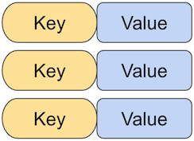
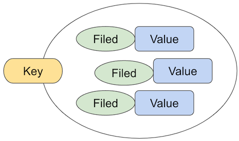
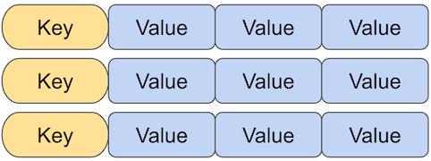
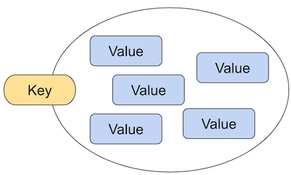
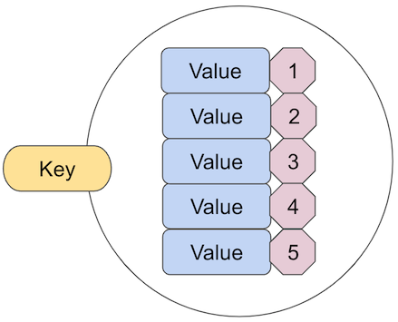

# Chapter 2

# Redis의 특징

1. Key & Value 데이터베이스로 분류되는 NoSQL이며, 2009년 개발되어 2015년에 상용SW로 개발
2. 키밸류 DB이면서 대표적인 In-Memory 데이터 처리 및 저장기술을 제공하기 때문에 상대적으로 빠른 Read/Write 가능
3. String, Set, Sorted Set, Hash, List, HyperLogLogs 등 유형의 데이터 저장 가능
4. Dump 파일과 AOF(Append Of File) 방식으로 메모리 상의 데이터를 디스크에 저장할 수 있습니다.
5. Master & Slave Replication 기능을 통해 데이터의 분산, 복제 기능을 제공하며 Query Off Loading 기능을 통해 Master는 Read/Write 를 수행하고 Slave는 Read 만 수행할 수 있습니다.
6. 파티셔닝(Partitioning)을 통해 동적인 스케일 아웃(Scale Out)인 수평 확장이 가능합니다.
7. Expriation 기능은 일정 시간이 지났을 때 메모리 상의 데이터를 자동 삭제할 수 있습니다.

### 주요 업무 영역

1. 인메모리 DB의 특성상 빠른 읽기와 쓰기 작업은 가능하지만 지속적인 관리가 필요한 비즈니스에서는 Sub DB로 사용되는 것이 보편적
2. 주된 영역은 데이터 캐싱(Caching)을 통한 빠른 쓰기/읽기 작업이 요구되는 영역과 IOT등 데이터 수집 및 처리, 실시간 분석 및 통계 영역
3. 메시지 큐(Message Queue), 머신 러닝(Machine Learning), Application Job Management, 검색엔진등의 영역

### 제품 유형

1. 커뮤니티 에디션
    
    오픈소스 라이센스를 기반으로 별도의 비용 청구 없이 사용 가능하지만 사용자의 전적인 책임하에 사용
    
2. 엔터프라이즈 에디션
    
    사용자가 사용하면서 발생하는 기술적 문제에 개발사가 책임지고 지원 및 유지 보수작업을 수행하며 보통 연간 단위의 유지보수 계약을 체결하며 그에 상응하는 비용을 지불하고 다양한 옵션을 활용
    

### Redis System 아키텍처

- 데이터 저장엔진
- 분산 시스템(Partitioning)
- 복제 시스템(Replication)
- Index Support
- 관리 툴(Redis-server, redis-cli, redis-benchmark 등)

3’rd Party Module 

- Redis Search Engine : 검색엔진
- RedisSQL : SQLite DB와 연동 솔루션
- RedisGraph : Graph DB와 연동 솔루션
- Redis sPiped : 암호화 솔루션

```bash
 # 설치 
docker pull redis

 # 도커 내부 network 브릿지 생성 별칭 redis-net 으로 설정함
docker network create redis-net

# 컨테이너 이름설정 후 실행 포트 포워딩, network 등 매개변수로 설정가능
docker run --name redis-test 

# redis_cli 로 네트워크를 통해 접속 
docker run -it --network redis-net --rm redis redis-cli -h redis-test

# 도커 컨테이너 내부에 직접 접속하여 redis-cli를 실행하여 접속
docker exec -it redis-test redis-cli --raw

```

 

### Redis 기본문법

```bash
redis-cli [OPTION] [cmd [arg [arg ...]]]

-h <hostname>  Server hostname (default: 127.0.0.1)
-p <port>      Server port (default: 6379)
-s <socket>    Server socket (overrides hostname and port)
-a <password>  Password to use when connection to the server
-u <uri>       Server URI
-r <repeat>    Execute specified command N times
-i <interval>  When -r is used, waits <interval> seconds per comand
-n <db>        Database number
-x             Read last argument from STDIN
-d <delimiter> Multi-bulk delimiter in for raw formatting (default: \n)
-c             Enable cluster mode (follow -ASK and -MOVED redirections)
--raw          Use raw formatting for replies (default when STDOUT is not a tty)
--no-raw       Force formatted output even when STDOUT is not a tty
--csv          Output in CSV format
--stat         Print rolling stats about server: mem, clients, ...
--latency      Enter a special mode continuosly sampling latency
...-history    Like --latency but tracking latency changes over time. Default time interval is 15 sec.
--latency-dist Shows latency as a spectrum , requires xterm 256 colors. Default time interval is 1 sec. Change it using -i
--lru-test key Simulate a cache workload with an 80-20 distribution
--slave        Simulate a slave showing commands received from the master
--rdb filename transfer an RDB dump from remote server to local file
--pipe         Transfer raw Redis protocol from stdin to server
...-timeout n  pipe mode, abort with error if after sending all data. no reply is received within n seconds. Default timeout: 30.
--bigkeys      Sample Redis keys looking for big keys
--hotkeys      Sample Redis keys looking for hoy keys
--sacn         List all keys using the SCAN command
--pattern pat  Useful with --scan to specify a SCAN pattern
--intrinic-latency sec Run a test to measure intrinsic system latency The test will run for the specified amount of seconds
--eval file    Send an EVAL command using the Lua script at file
--ldb          Used with --eval enable the Redis Lua debugger
--ldb-sync-mode Like --ldb but uses the synchronous Lua debugger
--version      Output version and exit
 

```

## Redis 데이터 처리

### 용어 설명

1. Table : 하나의 DB에서 데이터를 저장하는 논리적 구조 (RDB의 테이블과 논리적 개념이 동일)
2. Data Sets : 테이블을 구성하는 논리적 단위입니다. 하나의 데이터 셋은 하나의 Key와 한 개 이상의 Filed/Element 로 구성됩니다.
3. Key : 하나 이상의 조합된 값
4. Values : Key에 대한 구체적인 데이터 값

### 데이터 입력, 수정, 삭제, 조회

| set | 데이터를 저장할 때 |
| --- | --- |
| get | 저장된 데이터를 검색할 때 |
| rename | 저장된 데이터 값을 변경할 때 |
| randomkey | 저장된 key 중에 하나의 key를 랜덤하게 검색할 때 |
| keys | 저장된 모든 key를 검색할 때 |
| exits | 검색 대상 key가 존재하는지 여부를 확인할 때 |
| mset / mget | 여러 개의 key와 value를 한번 저장하고 검색할 때 |
| exists <key> | key 의 존재여부 검색 (return 있으면 1, 없으면 0)  |
| strlen <key> | value 의 길이 |
| flushall | 저장되어 있는 모든 key 삭제 |
| setex <key> (sec) <value> | value에 대해 일정 시간만 저장 |
| ttl | 현재 남은 시간 확인 |
| incr N | Incremental 증가값 + 1 |
| decr N | Decremental 감소값 - 1 |
| incrby N 2 | Incremental 증가값 + 2 |
| decrby N 10 | Decremental 감소값 - 10 |
| append <key> <value> | 현재 key 에  추가 value를 추가 |

### 데이터 타입

| strings | 문자, Binary 유형 데이터를 저장 |
| --- | --- |
| List  | 하나의 key에 여러 개의 배열 값을 저장 |
| Hash | 하나의 key에 여러 개의 Fields와 Value로 구성된 테이블을 저장 |
| Set, Sorted set  | 정렬/미정렬 String 타입, Set과 Hash를 결합한 타입 |
| Bitmaps | 0 과 1로 표현하는 데이터 타입 |
| HyperLogLogs | Element 중에서 unique 한 개수와 Element 만 계산 |
| Geospatial | 좌표 데이터를 저장 및 관리하는 데이터 타입 |

Redis에서 데이터를 표현할 때 기본 타입은 하나의 key와 하나 이상의 Field / Element 값으로 저장하는 방법입니다. Key에는 아스키 값을 저장할 수 있고 value에는 기본적으로 Strings 데이터를 저장할 수 있으며 추가로 컨테이너(Container) 타입의 데이터들을 저장할 수 있습니다. 컨테이너 타입에는 Hash, List, Set, Sorted Set 4가지 유형이 있습니다

1. Strings
    
    Redis에서 가장 기본적인 데이터 타입으로 value에 문자, 숫자 등을 저장한다. 저장 시 별도로 숫자 문자 구분이 없으며 binary safe 하므로 redis string이 파일, 직렬화 객체 등등 다양한 데이터 타입을 모두 포함할 수 있다. 최대 512MB의 길이를 가질 수 있다. 
    
    
    
2. Hash
    
    Hash 타입은 기존 관계형 DB에서 PK와 하나 이상의 컬럼으로 구성된 테이블 구조와 매우 흡사한 유형입니다.
    
    - 하나의 key는 오브젝트명과 하나 이상의 필드 값을 콜론(:) 기호로 결합하여 표현할 수 있습니다.
    - 문자 값을 저장할 때는 인용부호(””)를 사용하며 숫자 값을 저장할 때는 인용부호가 필요하지 않습니다.
    - 필드 개수는 제한이 없습니다.
    - Hash 타입의 데이터를 처리할 때는 hmset, hget, hgetall, hkey, hlen 명령어가 있습니다.
        
        
        
    
3. List 
    
    기존의 관계형 테이블에는 존재하지 않는 데이터 유형이며, 일반적인 프로그래밍 언어에서 배열과 유사한 데이터 구조입니다. 단순히 삽입 순서로 정렬된 String List 이며, String 타입이 배열 구조로 구성됐다고 할 수 있다. List 타입의 데이터를 처리할 때는 lpush, lrange, rpush, rpop, llen, lindex 명령어가 있습니다.
    
    
    
4. Set
    
    List 타입은 하나의 필드에 여러 개의 배열값을 저장할 수 있는 데이터 구조라면 Set 타입은 배열 구조가 아닌 여러 개의 엘리먼트로 데이터 값을 표현하는 구조입니다. 정렬되지 않은 String collection 이며, List형에서 인덱스가 없어진 형입니다. Value에 중복이 없으며 Lists 보다 빠르게 처리가 가능합니다. Set타입의 데이터를 처리할 때는 sadd, smembers, scard, sdiff, sunion 명령어를 사용합니다.
    
    
    
5. Sorted Set
    
    Set타입과 동일한 데이터 구조지만 저장된 데이터 값이 정렬된 상태입니다. Set 타입에서 스코어라는 개념이 붙은 타입으로 스코어 순서로 정렬하거나 스코어에서 임계값 처리가 가능합니다. 데이터를 처리할 때는 zadd, zrange, zcard, zcount, zrank, zrevrank 명령어를 사용합니다. 
    
    
    

1. Bit 
    
    컴퓨터가 이해하는 0과 1로 표현되는 Bit값으로 가장 빠르게 해석되며 표현하는 구조입니다. 데이터를 처리할 때 setbit, getbit, bitcount 명령어를 사용합니다. 
    
2. Geo 
    
    위치정보(경도,위도) 데이터를 효율적으로 저장, 관리 할 수 있으며 이를 활용한 위치 정보 데이터의 분석 및 검색에 사용할 수 있습니다. 데이터를 처리할 때 geoadd, geopos, geodist, georadius, geohash 명령어를 사용합니다. 
    
3. HyperLogLogs
    
    RDBMS 에서 Check 제약조건과 유사한 개념의 데이터 구조로 특정 필드 또는 엘리멘트에 저장되어야 할 데이터 값을 미리 생성하여 저장한 후 필요에 따라 연결하여 사용할 수 있는 데이터 타입입니다. 데이터를 처리할 때 pfadd, pfcount, pfmerge 명령어를 사용합니다.
    

## Redis 확장 모듈

최초에 Redis는 Community Edition으로 개발되면서 지속적인 기능 추가 및 서버 확장에 한계를 느껴 사용자들이 이를 개선하고자 Redis 소스를 이용해 다양한 기능들을 배포하게 되었고 이를 확장 모듈이라고 합니다. 

- REJSON : JSON 타입의 데이터를 처리할 수 있는 모듈
- RedisSQL : SQLite(RDBMS)로 데이터를 저장할 수 있는 모듈
- RediSearch : Redis에 저장된 데이터에 대한 검색엔진을 사용할 수 있는 모듈
- Redis-ML : 머신러닝을 사용할 수 있는 모듈
- Redis-sPiped : 전송되는 데이터를 암호화 할 수 있는 모듈

### Lua Function & Script

- Lua 는 가볍고 내장 가능한 Script Programming Language 중 하나이며 절차형, 객체지향 , 데이터베이스 기반 프로그래밍을 수행할 수 있습니다.
- 간단한 프로시저와 배열로 결합할 수 있으며 동적으로 코딩가능 하고 가상머신 기반에 바이트 코드를 해석하여 실행할 수 있고 증분 가비지 컬렉션으로 메모리를 자동으로 관리합니다.
- Lua는 브라질 리오 데 자네이로 교황청 카톨릭 대학교 PUC-Rio 팀에서 개발 및 유지 관리되고 있습니다.
- Redis Server는 내장된 Lua Interpreter를 통해 미리 작성된 Lua Script 또는 Function을 실행할 수 있습니다.
- 다양한 Lua Function을 통해 데이터를 검색, 수정, 삭제, 입력을 할 수 있습니다.