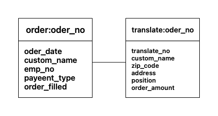

# Chapter 4

# Redis Data Modeling

## Key-Value 데이터 모델링 개념

Redis도 RDB와 동일하게 ‘테이블’ 이라는 명칭은 같습니다. 하지만 컬럼은 ‘필드’(Field), 혹은 ‘엘리멘트’(Eliment) 라고 표현하며 하나의 식별키와 컬럼들로 구성되듯, 레디스도 하나의 Key와 필드 또는 엘리멘트로 구성됩니다. RDB같은 제약 조건은 기능은 없지만 CHECK 조건처럼 조건을 만족하는 데이터만을 저장할 수 있도록 Hyperloglogs 데이터 속성을 이용해 데이터를 관리할 수 있습니다.

### 모델링 가이드 라인

1. Hash 데이터 모델

   RDB에서 부모-자식(Parent-Child) 테이블에 해당됩니다. 주문-운송 관계, 글-댓글 관계 처럼 부모 데이터가 있어야 하위 요소인 자식 데이터를 생성할 수 있는 구조를 의미합니다.

2. List 데이터 모델

   RDB에서 마스터-디테일 테이블과 유사한 구조입니다. 예로 주문전표를 정규화 과정을 거쳐 정리하면
   주문공통 테이블-주문상세 테이블로 설계할 수 있는데, 여기서 Master 테이블은 주문 상세 테이블에 대한 정보를 저장하기 위한 구조이고, Detail 테이블은 항목번호별 상세 정보를 담게되는 구조입니다. 객체지향 프로그래밍 언어에서 배열과 유사합니다.

3. Set 데이터 모델

   RDB의 계층형 테이블에 해당되며 식별키를 기준으로 참조하는 구조를 의미하며 Self-Reference 관계 테이블이라고도 표현합니다.

4. HyperLogLogs 데이터 모델

   RDB의 CHECK 제약조건에 해당되는 구조로 RDB에서는 3가지 방법으로 구현할 수 있는데, 첫 번째 애플리케이션을 통해 데이터를 입력 및 수정할 때 조건을 만족하는 데이터인지 여부를 확인하는 방법, 두 번째 특정 조건의 데이터 값을 임의의 테이블에 미리 저장해둔 다음 해당 테이블에 데이터를 입력 및 수정할 때 임의의 테이블과 식별키와 외부키로 검증하는 방법, 세 번째 테이블에 특정 컬럼을 Check 제약조건으로 설정하는 방법입니다.

### 데이터 모델

Redis에서 설계할 수 있는 데이터 모델 유형은 크게 5가지 입니다.

- Hash-Hash 모델

  주문 테이블과 운송 테이블은 대표적인 Hash-Hash 테이블로 설계될 수 있는 테이블 구조입니다.

  

- Hash-List 모델

  주문공통 테이블과 주문상세 테이블은 대표적인 Hash-List 데이터 모델입니다.

  

- List-List 모델

  제품 테이블과 카테고리 테이블로 이루어진 구조가 대표적인 데이터 모델입니다. N:M 구조로 표현할 수 있습니다.

  

- Set 모델

  일반적으로 관계형 DB는 하나의 테이블과 관계되는 상대 테이블을 식별키와 외부키로 표현할 수 있으며 이를 통해 데이터 무결성을 보장할 수 있는 데이터 구조로 설계할 수 있습니다. 그러나 하나의 테이블과 관계되는 상대 테이블이 자기 자신이 될 수도 있는 데이터 구조를 계층 구조 테이블이라고도 표현하는데, Redis 이와 같은 데이터 구조를 설계할 수 있는데 이를 SET 테이블이라고 합니다.