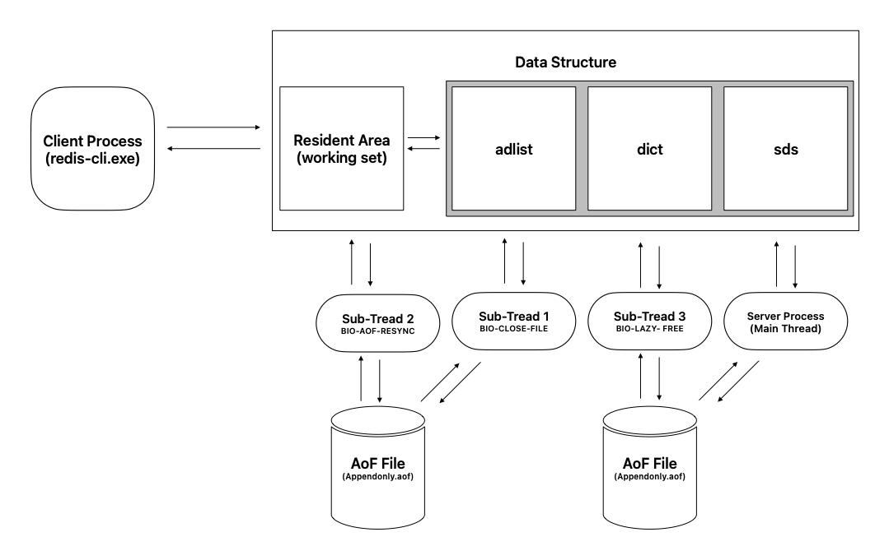

# Redis Architecture



Redis Architecture

1. 메모리 영역
    1. Resident Area : 사용자가 redis 서버에 접속해서 처리하는 모든 데이터가 가장 먼저 저장되는 영역이며, 실제 작업이 수행되어 Working Set 영역이라고 표현합니다.
    2. Data Structure : 다양한 정보와 서버 상태를 모니터링하기 위해 수집한 상태 정보를 저장하고 관리하기 위한 메모리 공간이 필요합니다. 이를 위한 공간이 Data Structure 입니다.
2. 파일 영역
    1. AOF 파일 : 모든 데이터를 메모리 상에 저장하고 관라하는 인-메모리 기반의데이터 처리기술을 제공하는게 Redis입니다. 하지만 중요한 데이터의 경우 사용자의 필요에 따라 지속적으로 저장해야 할 필요가 있는데 이를 위해 제공되는 디스크 영역이 AOF 파일입니다. (스냅샷 데이터)
    2. DUMP 파일 : AOF 파일과 같이 사용자 데이터를 디스크 상에 저장할 수 있지만 소량의 데이터를 일시적으로 저장할 때 사용되는 파일입니다.
3. 프로세스 영역
    1. Server Process : redis-server.exe 또는 redis-sentinel.exe 실행 코드에 의해 활성화되는 프로세스를 서버 프로세스라고 하며 Redis 인스턴스를 관리해 주며 사용자가 요구한 작업을 수행하는 프로세스입니다. Redis Server Process는 4개의 멀티 쓰레드로 구성되는데 main thread, sub thread 1, sub thread 2, sub thread 3 입니다.
        - main thread : 해당 쓰레드는 Redis 서버에 수행되는 대부분의 명령어와 이벤트를 처리하는 역할을 수행합니다.
        - sub thread 1 : 쓰레드 1은 AOF(append only file) 에 데이터를 rewrite 할 때 기존 파일은 close 하고 새로운 AOF 파일에 Write 할 때 사용됩니다.
        - sub thread 2 : 쓰레드 2는 AOF에 쓰기 작업을 수행할 때 사용됩니다.
        - sub thread 3 : 쓰레드 3은 UNLINK, FLUSHALL, FLUSHDB 명령어를 실행할 때 빠른 성능을 보장하기 위해 백그라운드에서 사용됩니다.
    2. Client Process : redis-cli.exe 또는 사용자 애플리케이션에 의해 실행되는 명령어를 실행하기 위해 제공되는 프로세스 입니다.

여기에 분산,복제가 가능한 클러스터 환경에서는 추가적인 프로세스 유형이 요구될 수 있습니다.

# 시스템 & Disk 사양

서버를 구축할 때 서버의 사양은 최적화를 하는 것이 좋은데, 항목별로 정리했습니다.

1. 노드 수 (# of nodes per cluster)

   단일서버(Standalone)를 구축하는 경우에 Master 서버 1대, Slave 서버 1대, FailOver와 Load-Balancing을 위한 Sentinel 서버 1대로 구성하는 경우 최소 3대의 서버가 요구됩니다. 그러나 Master 와 Slaves 서버는 이중 복제이기 때문에 크리티컬한 비즈니스 환경에서는 필요에 따라 추가 복제가 요구될 수 있습니다.

2. CPU Core 수 (# of cores per node)

   Redis같은 NoSQL의 경우 여러 세션에서 초당 10~20만건의 데이터 처리가 가능합니다. 최근 하드웨어엔 기본 4코어 이상이기 때문에 Small 트래픽인 경우 4 Core, Medium 4~8 Core, Big 8~16 Core 이상으로 선택해야 합니다.

3. RAM 크기

   Redis  서버를 위한 최소 권장 사양은 14~15GB 로 하나의 시스템이 16GB의 메모리 크기를 갖는다면 그중 90~95% 공간을 Redis 서버가 사용할 수 있어야 한다는 것을 의미합니다. 가끔 하나의 서버에 웹서버등과 같이 설치하는 경우가 있는데 이는 바람직하지 않습니다. RAM의 크기는 세션 수, 데이터양, 처리방법, 초당 트래픽에 의해 결정되야 합니다. Small 16GB, Medium 32 ~ 64GB, Big 64~128GB 이상입니다.

4. 스토리지 타입

   가장 저렴한 비용은 SATA 타입의 디스크 저장장치를 사용하는 것입니다. 하지만 보통 SSD를 사용합니다. Redis 서버에서는 인 메모리 기반이므로 스토리지에 과도한 비중을 둘 필요는 없습니다.

5. 스토리지 크기

   데이터양을 고려하여 저장장치의 용량을 결정해야 합니다.
   최소 스토리지 크기 = 데이터의 총 크기 + (RAM X 3)
   권장 스토리지 크기 = 데이터의 총 크기 + (RAM X 6)

6. 네트워크

   보통 NoSQL은 Scale out 을 기반으로 분산, 복제 시스템이 기본 구성됩니다. 그러므로 최소 네트워크 환경은 1G 환경이며 권장 환경은 10G 이상입니다.


# 메모리 운영 기법

### 1. LRU(Least Recently Used) 알고리즘

Redis 에서 제한된 메모리 공간에서 효율적인 운영을 위해 사용되는 LRU 알고리즘은 **가장 최근에 처리된 데이터들을 메모리 영역에 최대한 재 배치**시키는 알고리즘입니다. 사용할 수 있는 메모리 크기는 정해져 있는데 그 공간에 데이터를 저장해야 한다면 가장 최근에 입력, 수정, 삭제, 조회된 데이터를 저장하고 오래 전에 처리된 데이터는 제거하여 최근 사용된 데이터들이 최대한 메모리 상에 존재할 수 있도록 운영하는 것입니다.

### 2. LFU(Least Frequently Used) 알고리즘

자주 참조되는 데이터만 배치하고 그렇지 않은 데이터들은 메모리로부터 제거하여 자주 참조되는 데이터들이 배치될 수 있도록 운영하는 방법을 LFU알고리즘이라고 합니다.

# LazyFree 파라미터

초당 수만~수십만건의 데이터가 처리되는 환경에서는 빠른 시간 내에 Redis 인스턴스에게 할당된 메모리 영역이 최대 임계치까지 도달하게 되는데 이경우, 연속적인 범위 키 값이 동시에 삭제되는 오퍼레이션이 실행되면 메모리 부족과 프로세스의 지연처리로 인해 성능 지연문제가 발생하게 됩니다.

이와 같은 성능 지연 문제를 해소할 수 있는 방법은 Redis 인스턴스를 위한 메모리 영역의 크기를 충분히 할당하는 것과 더불어 LazyFree 파라미터를 설정해 주는 것입니다. LazyFree 파라미터는 별도의 백그라운드 쓰레드를 통해 입력과 삭제 작업이 지여노디지 않고 연속적으로 수행될 수 있도록 해 줍니다. 참고로 Redis 아키텍처에서 서버 프로세스 중 하나입니다.

### 1. lazyfree-lazy-eviction

메모리 영역이 Full 되었을 때 연속적인 범위의 Key 값을 삭제하면 기존 메모리 영역에 저장되어 있던 데이터는 DEL 명령어에 의해 삭제하는데 이 작업은 서버 프로세스의 메인 스레드에 의해 실행되면서 블록킹 현상이 발생합니다. 이 파라미터를 “YES”로 설정할 경우 DEL 명령어가 아닌 UNLINK 명령어가 실행되고 서버 프로세스의 Sub Thread 3에 의해 백그라운드에서 수행되기 때문에 블록킹 현상을 피할 수 있게 됨으로써 성능을 향상시킬 수 있습니다.

### 2. lazyfree-lazy-expire

EXPIRE 명령어를 실행하면 메모리 상에 무효화된 키 값을 삭제하는데 내부적으로 DEL 명령어가 실행되면서 블록킹 현상이 발생합니다. 이 파라미터 값을 “YES”로 설정하면 UNLINK 명령어가 실행되면서 블록킹 현상을 피할 수 있습니다.

### 3. lazyfree-lazy-server-del

메모리 상에 이미 저장되어 있는 키 값에 대해 SET 또는 RENAME 명령어를 실행하면 내부적으로 DEL 명령어가 실행되면서 블록킹 현상이 발생합니다.

### 4. slave-lazy-flush

Master-Slave 또는 Partition-Replication 서버 환경에서 복제 서버는 마스터 서버의 데이터를 복제할 때 변경된 부분에 대해서만 부분 복제하는 경우도 있지만 때에 따라서는 기본 복제 데이터를 모두 삭제한 후 다시 복제하는 경우도 있습니다. 이 경우 복제 데이터를 빠른 시간내에 삭제하고 동시에 다시 복제 작업을 빠르게 수행해야 합니다.

# Data Persistence

Redis 데이터베이스를 사용하는 환경에서도 중요한 데이터를 영속적으로 보관할 필요때가 있습니다. 이 때 디스크 저장 장치에 파일로 저장할 수 있습니다. 또한 Redis 서버를 재시작한 후 파일에 저장해둔 데이터를 다시 메모리로 업로드할 수도 있습니다. 데이터를 지속적으로 저장하는 방법에는 SAVE 명령어를 이용하거나 AOF 명령어로 저장하는 방법이 있습니다.

## 1. RDB 파일을 이용하여 저장하는 방법

첫 번째 방법은 SAVE 명령어를 이용하여 일정한 주기(Interval) 마다 일정한 개수의 Key 데이터-셋 값을 디스크 상에 dump.rdb 파일로 저장하는 방법입니다. 사용자가 저장 주기와 저장 단위를 결정할 수 있고 시스템 자원이 최소한으로 요구된다는 장점이 있지만 데이터를 최종 저장한 이후 새로운 저장이 수행되는 시점 전에 시스템에 장애가 발생한다면 데이터 유실이 발생할 수 있기 때문에 지속성이 떨어진다는 단점이 있습니다.

## 2. AOF(Append Only File) 명령어를 이용하여 저장하는 방법

두 번째 방법은 AOF 명령어를 이용하여 디스크 상에 appendonly.aof 파일로 저장하는 방법입니다. 이 방법은 redis-shell 상에서 bgrewriteaof 명령어를 실행한 이후에 입력, 수정, 삭제되는 모든 데이터를 저장해 줍니다.

## 차이점

| AOF(Append Only File) | RDB(SnapShot) |
| --- | --- |
| 시스템 자원이 집중적으로 요구 (지속적인 쓰기 작업 발생) | 시스템 자원이 최소한으로 요구 (특정 시점에 쓰기 작업이 발생) |
| 마지막 시점까지 데이터 복구가 가능 | 지속성이 떨어짐 (특정 시점마다 저장) |
| 대용량 데이터 파일 복구 작업 시 복구 성능이 떨어짐 | 복구 시간이 빠름 |
| 저장 공간이 압축되지 않기 때문에 데이터 양에 따라 크기 결정 | 저장 공간이 압축되기 때문에 최소 필요 (별도의 파일 압축이 필요 없음) |

# Copy on Write

Redis의 경우 충분한 메모리 공간을 확보하는 것은 시스템의 원활한 운영과 관리를 위해 반드시 요구되는 핵심 포인트 중에 하나입니다. 하지만 디스크 영역에 저장할 데이터 보다 더 큰 메모리 영역을 확보하는 것은 현실적으로 가능하지 않습니다.

메모리 상에 로더되어 있는 데이터를 하나의 부모 프로세스가 참조하고 있는 와중에 자식 프로세스가 동시에 참조관계를 가지게 되는 경우 서버 프로세스는 별도의 저장공간에 이를 복제하게 되는데 이와 같은 경우를 **Copy on Write** 라고 표현합니다.

Copy on Write 가 빈번하게 발생하게 되면 해당 오퍼레이션은 지연되며 이는 redis server 전체의 성능 지연 문제로 이어 집니다. 이와같은 현상이 자주 발생하지 않도록 데이터를 처리하고 설사 발생했다 하더라도 지연 문제가 덜 발생하고 빨리 해소될 수 있도록 충분한 메모리 영역을 확보하는 것도 매우 중요한 성능 포인트입니다.

### Copy on Write가 발생하는 경우들

- SAVE 파라미터에 의해 주기적으로 RDB 파일을 생성할 때

  SAVE 명령어 또는 관련 파라미터는 Redis 워킹세트(WorkingSets) 영역에 저장되어 있는 데이터를 디스크의 dump.rdb 파일로 저장할 때 사용됩니다. 이 경우가 Copy on Write 발생하는 대표적인 경우 입니다.

- BGSAVE 명령어에 의해 RDB 파일을 저장할 때

  SAVE 명령어와 함께 BGSAVE 명령어도 동일한 방법으로 발생합니다.

- BGREWRITEAOF 명령어에 의해 AOF 파일을 저장할 때

  SAVE, BGSAVE 는 dump.rdb 파일에 쓰기 작업이 발생한다면 BGWRITE 는 appendonly.aof 파일에 쓰기 작업이 발생하는 경우에 발생

- auto-aof-rewrite-percentage 파라미터에 의해 AOF 파일을 재저장 할 때

  AOF 파일이 가득 채워진 상태에서 계속적으로 데이터를 저장해야 하는 경우, AOF 파일을 비우고 처음부터 다시 쓰기 작업을 수행하는 경우도 발생합니다. 성능 이슈가 발생하는 비즈니스 환경에서 해당 파라미터의 적극적인 사용은 권장하지 않습니다.

- Master-Slave, Partition-Replication Server 환경으로 구동할 때

  Master 서버의 데이터를 Slave 서버에 복제할 때 발생합니다.


# Benchmark For Redis

Redis 를 사용해 운영하다 보면 성능 이슈가 발생할 수 있습니다. 이럴 때 문제 해결을 위해서는 원인이 실행되고 있는 서버의 시스템 환경에서 수정해야 하지만 쉽지 않은 작업입니다. 이런 경우 Redis 에서는 redis-benchmark.exe 실행코드를 제공하는데 이를 통해 실제와 같은 데이터를 임의로 발생시켜 성능 이슈가 발생할 수 있는 가상 상태로 만들어 성능 최적화 작업을 수행할 수 있습니다.

```bash
redis-benchmark [-h <host>] [-p <port>] [-c <client>] [-n <requests>] [-k <boolean>]
```

# 관리 명령어

| parameter | description |
| --- | --- |
| info | redis server의 현재 상태 확인  |
| select | redis server 내에 생성되어 있는 DB로 swtich 할 때 |
| dbsize | 현재 데이터베이스에 생성되어 있는 keys 수 |
| swapdb | 현재 데이터베이스에 할당할 swap DB 생성 |
| flushall,
flushdb | 현재 생성되어 있는 모든 keys 및 db 해제 |
| client list,
client getname,
client kill | 현재 redis server 에 접속되어 있는 /client 정보 조회,
client 명 조회,
해당 client 제거 |
| time | redis server 의 현재 시간 |

# Data Export & Import

앞서 Redis 의 기본 아키텍처는 1차적으로 모든 데이터의 저장과 관리를 메모리에서 합니다. 이를 디스크에 즉시 보관하지 않는 이유는 디스크 IO로 인해 발생하는 성능 지연 문제를 피하고 성능 개선을 목적으로 합니다. 하지만 모든 데이터를 메모리에 저장 관리만 할수는 없는데 그 이유는 예기치 못한 원인으로 인해 시스템이 종료되는 경우 데이터가 유실될 수 있기 때문입니다. 이 경우와 더불어 Redis 서버 또는 타 지역의 서버로 이전해야 하는 경우도 발생할 수 있습니다.

# Redis Serialization Protocol & Mass Insertion

### 1. Luke Protocol을 이용한 업로드 방식

보통 데이터를 Redis 클라이언트를 통해 Redis 서버로 저장해야 하는 경우들이 종종 발생합니다. 이 때 대부분은 Redis 명령어로 작성된 데이터 파일을 생성하여 Inserting 하는 방법을 선택합니다. 하지만 이와 같은 방법은 대량의 데이터를 저장하는 방법으로는 좋은 방법이 아닙니다. 그 이유는 클라리언트 레벨에 작성된 텍스트 파일의 명령어는 네트워크를 통해 Redis 서버로 전송되어야 하고 처리된 결과는 다시 클라이언트로 전당되는 방식으로 빠른 성능을 보장할 수 없습니다.

```bash
$ vi luke_test.dat
	set 1101 JMJOO
	set 1102 YHJOO
	set 1103 KOHONG
$ ../src/redis-cli -p 5000 flushall
	Ok
$ cat test_data.txt | ../src/redis-cli -p 5000 --pipe
	All data transferred. Waiting for the lash reply
	Last reply received from server
	error: 0, replies: 3
$ ../src/redis-cli -p 5000 --scan
	1101
	1102
	1103
```

### 2. Request Response Protocol 을 이용한 업로드 방식

앞서 Luke Protocol의 단점은 업로드 성능 지연문제인데 이를 해결할 수 있는 방안으로 RERP(Redis Serialization Protocol) 방식입니다. 이는 원시(Raw) 형식의 Redis Protocol 이 내장된 텍스트 파일을 사전에 작성하여 호출하는 방식인데 아래 도표를 통해 보다 구체적으로 보자면

| 구분자 | 용도 |  |
| --- | --- | --- |
| + | 문자열(Simple Strings) | “+JMJOO\r\n” |
| : | 숫자(Integer) | “:1000\r\n” |
| $ | 대용량 문자열(Bluk Strings) | “$1101\r\nSki Boots\r\n”
”$1102\r\n\r\n |
| * | 배열(Array) | “*0\r\n”
”*2\r\n$3\r\nnfoo\r\n$4\r\nbar\r\n”
”*3\r\n:1\r\n:2\r\n:3\r\n” |
| - | 에러 값(Errors) | “-Error message\r\n” |

위 도표에서 구분자는 저장해야 할 데이터 값 바로 앞에 배치하면 되는데 값의 속성을 의미합니다.

RERP 방식의 장점은

- 쉽고 간단하게 데이터를 표현할 수 있음
- 문자열이 아닌 기호 방식으로 데이터를 표현하기 때문에 빠른 파싱(parsing)이 가능
- 정수, 문자, 배열 데이터를 직렬화 할 수 있고 Redis 클라이언트와 Redis Server 사이에만 사용되는 프로토콜이기 때문에 보안에 대한 안정성이 높습니다.
- Redis 1.2 버전에서 처음 소개되어 2.0버전에서부터 표준 프로토콜이 됨